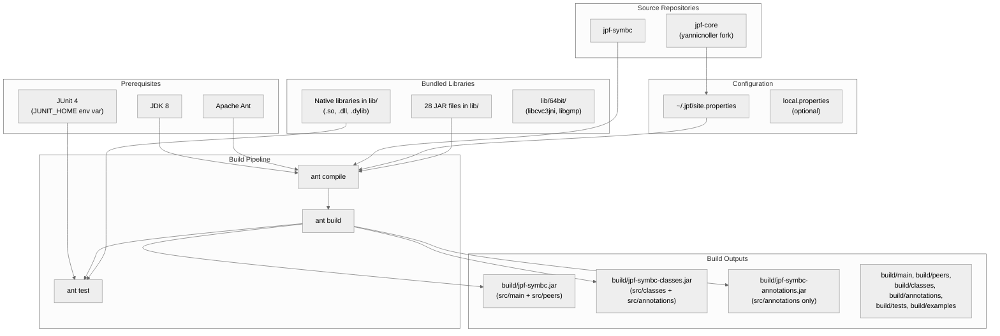
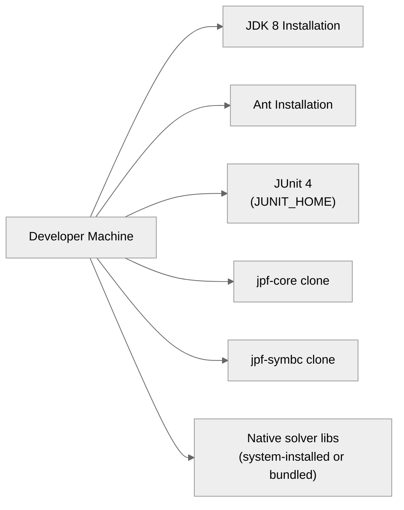

# Allocation View: Install

## Primary Presentation

The Install view documents how JPF-SymBC is built, packaged, and deployed onto a development machine.

## Element Catalog

### Prerequisites

| Prerequisite | Version | Purpose |
|-------------|---------|---------|
| JDK | 8 (source level 8) | Compilation and runtime. Does not work with later versions. |
| Apache Ant | (any recent) | Build system. Reads `build.xml` in project root. |
| jpf-core | yannicnoller fork, commit `0f2f2901cd` | Peer directory dependency. Must be built first. |
| JUnit 4 | 4.x | Test execution. Path set via `JUNIT_HOME` environment variable. |

### Configuration Files

| File | Location | Purpose |
|------|----------|---------|
| `site.properties` | `~/.jpf/site.properties` | Registers `jpf-core` and `jpf-symbc` paths. Used by JPF runtime and by the Ant build to locate jpf-core. |
| `jpf.properties` | Project root | Extension properties. Defines classpath entries, native library paths, default settings. Read by JPF at runtime. |
| `local.properties` | Project root (not in VCS) | Optional local overrides. Loaded before other property files. |
| `build.xml` | Project root | Ant build script. Defines compile, build, test, clean targets. |

### Build Targets

| Target | Dependencies | Action |
|--------|-------------|--------|
| `compile` | `-init` | Compiles all 6 source roots into separate `build/` subdirectories. Source level: Java 8. |
| `build` (default) | `compile` | Creates 3 JAR files from compiled classes. |
| `test` | `build` | Runs JUnit 4 tests in forked JVMs (1024 MB max). Requires `JUNIT_HOME`. Excludes several test classes. |
| `clean` | (none) | Deletes `build/` directory and backup files. |

### Build Outputs

| Artifact | Contents | Used By |
|----------|----------|---------|
| `build/jpf-symbc.jar` | `build/main` + `build/peers` | JPF runtime (host JVM classpath) |
| `build/jpf-symbc-classes.jar` | `build/classes` + `build/annotations` | JPF runtime (JPF VM classpath) |
| `build/jpf-symbc-annotations.jar` | `build/annotations` only | Non-JPF applications that reference `@Symbolic` etc. |
| `build/main/`, `build/peers/`, etc. | Compiled `.class` files | Test execution classpath |

### Bundled Libraries (lib/)

28 JAR files are committed to the repository. They are not fetched from a dependency manager.

| Category | JARs |
|----------|------|
| SMT Solvers | `com.microsoft.z3.jar`, `libcvc3.jar`, `libcvc3-5.0.0.jar`, `yicesapijava.jar`, `STPJNI.jar` |
| Constraint Programming | `choco-1_2_04.jar`, `choco-solver-2.1.1-*.jar` |
| Metaheuristic Solver | `coral.jar`, `opt4j-2.4.jar` |
| String Solving | `automaton.jar`, `hampi.jar`, `string.jar` |
| SAT Solving | `org.sat4j.core.jar`, `org.sat4j.pb.jar` |
| Unified Framework | `green.jar` |
| Utility | `commons-lang-2.4.jar`, `commons-math-1.2.jar`, `aima-core.jar`, `scale.jar`, `iasolver.jar` |
| Other | `bcel.jar`, `grappa.jar`, `jaxen.jar`, `jedis-2.0.0.jar`, `JSAP-2.1.jar`, `proteus.jar`, `Statemachines.jar`, `solver.jar`, `PathConditionsReliability-0.0.1.jar` |

### Native Libraries

Platform-specific shared libraries are required for Z3 and CVC3:

| Platform | Libraries | Location |
|----------|-----------|----------|
| Linux amd64 | `libz3java.so`, `libz3.so`, `libcvc3jni.so`, `libabc.so` | `lib/`, `lib/64bit/` |
| Windows amd64 | `libz3java.dll`, `libz3.dll` | `lib/` |

The `lib/64bit/` directory also contains `libgmp.so` (dependency of CVC3).

## Context Diagram

## Variability Guide

- **jpf-core location**: Defaults to `../jpf-core` (peer directory). Can be overridden in `~/.jpf/site.properties` or `local.properties`.
- **JUnit location**: Set via `JUNIT_HOME` environment variable. Can be overridden by `junit.home` property in `local.properties`.
- **Native library paths**: Configured per platform in `jpf.properties` (e.g., `jpf-symbc.Linux.amd64.native_libraries`). Linux requires Z3 and CVC3 shared libraries to be in `lib/` or on `LD_LIBRARY_PATH`.
- **Test exclusions**: Several test classes are excluded from automated `ant test` runs via patterns in `build.xml` (bitwise tests, lazy tests, string tests, coverage tests, and others).

## Rationale

The project uses Ant rather than Maven or Gradle because it follows the jpf-core build convention established by the JPF project. All library JARs are committed to the repository (`lib/`) rather than fetched from a dependency manager. This makes builds reproducible without network access but increases repository size and complicates library version tracking. Two of the SAT4J JARs are custom builds not available from Maven Central.

The 6-source-root structure (`main`, `classes`, `annotations`, `peers`, `tests`, `examples`) is mandated by JPF's dual-classloader architecture: code in `src/main` and `src/peers` runs on the host JVM, while code in `src/classes` and `src/annotations` runs inside the JPF virtual machine. These must be compiled and packaged separately.
