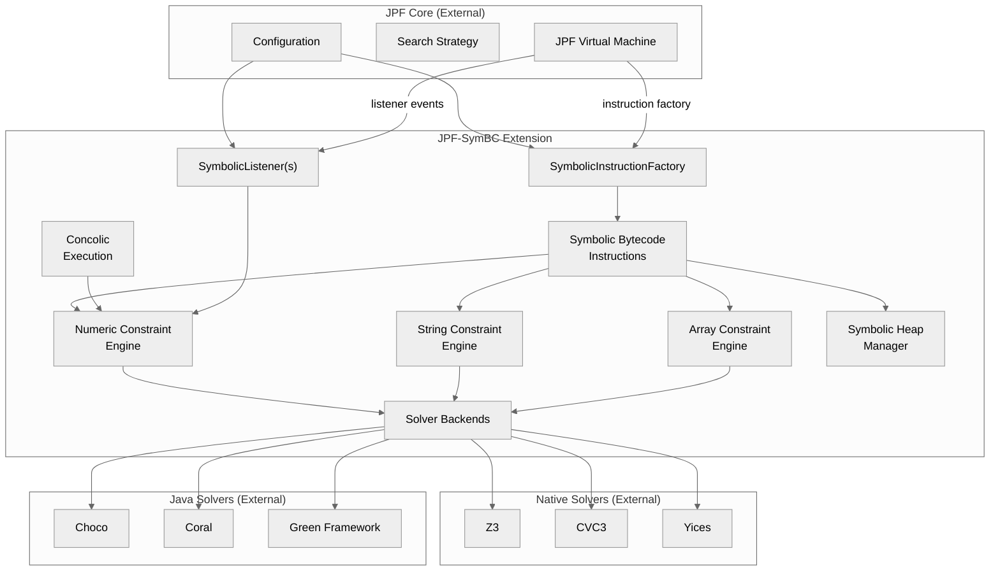

# System Overview

## Purpose

JPF-SymBC (Symbolic Java PathFinder) is an extension to the Java PathFinder (JPF) model checker that adds symbolic execution capabilities. It performs non-standard interpretation of JVM bytecodes, replacing concrete operations with symbolic counterparts that track constraints along execution paths. At branch points, it forks exploration into multiple paths, accumulating path conditions that are dispatched to pluggable constraint solvers (Z3, Choco, Coral, CVC3, and others) to determine feasibility. The system supports symbolic integers, reals, longs, booleans, strings, arrays, and user-defined data structures through lazy initialization of the heap.

JPF-SymBC operates as a JPF extension, not a standalone application. It hooks into the JPF virtual machine through two primary integration points: an instruction factory that replaces standard bytecodes with symbolic versions, and event listeners that track symbolic state across method invocations and path exploration.

## High-Level Component Diagram

## Technology Stack

| Layer | Technology |
|-------|-----------|
| Language | Java 8 |
| Build System | Apache Ant |
| Host Framework | JPF Core (custom fork, yannicnoller branch) |
| Test Framework | JUnit 4 |
| Primary SMT Solver | Z3 (via JNI, com.microsoft.z3.jar + native libs) |
| Constraint Programming | Choco 1.2.04, Choco 2.1.1 |
| Constraint Optimization | Coral (with opt4j 2.4) |
| Additional SMT Solvers | CVC3 (via JNI), Yices (via JNI), IAsolver, dReal |
| String Solving | Automaton, ABC, Z3-str2, HAMPI |
| Unified Solver Framework | Green |
| Utility Libraries | commons-lang 2.4, commons-math 1.2, SAT4J (custom builds), BCEL, aima-core |

## Key Architectural Drivers

1. **Extensibility of solver backends**: The architecture is designed to support multiple constraint solvers through a common abstract interface (`ProblemGeneral`). Solver selection is a runtime configuration choice, not a compile-time decision.

2. **Compatibility with JPF Core**: JPF-SymBC must conform to JPF's extension model, integrating through the instruction factory and listener mechanisms. This constrains the overall structure to follow JPF's conventions.

3. **Coverage of JVM bytecode operations**: Every arithmetic, comparison, and type-conversion bytecode has a symbolic counterpart. This drives the large number of classes in the `bytecode` package (102 files in the main package, 19 in `optimization`, 19 in `symarrays`).

4. **Separation of constraint domains**: Numeric, string, and array constraints are handled by separate subsystems with their own expression trees, path conditions, and solver translations.

5. **Configuration-driven behavior**: All significant behavioral variations (solver choice, symbolic method selection, optimization modes, concolic execution, array theory support) are controlled through `.jpf` property files, not code changes.
