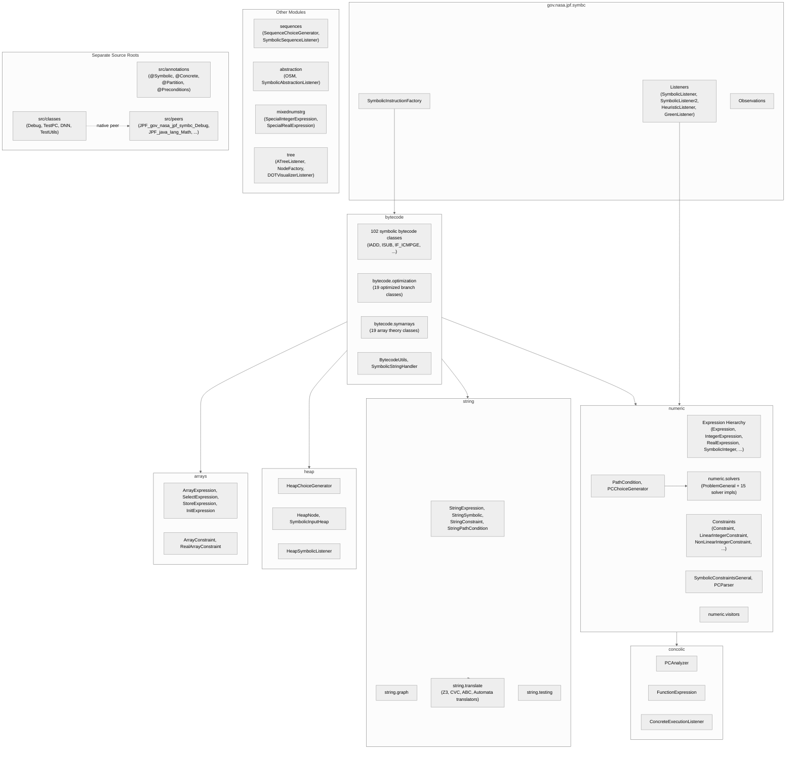
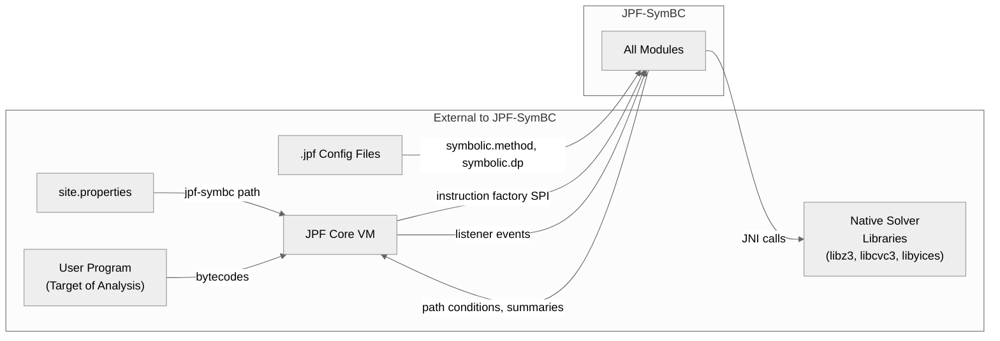

# Module View: Decomposition

## Primary Presentation

## Element Catalog

### Root Package (`gov.nasa.jpf.symbc`)

| Element | Responsibility |
|---------|---------------|
| `SymbolicInstructionFactory` | Entry point for bytecode replacement. Extends JPF's `InstructionFactory`. Uses `ClassInfoFilter` to selectively intercept bytecodes for target classes. Reads all `symbolic.*` configuration properties. |
| `SymbolicListener` | Primary event listener. Extends `PropertyListenerAdapter`, implements `PublisherExtension`. Intercepts method invocations and returns to collect path conditions and generate method summaries. |
| `SymbolicListener2` | Alternative listener implementation with different summary generation behavior. |
| `HeuristicListener` | Listener that tracks state advancement for heuristic-guided search strategies. |
| `GreenListener` | Listener that manages Green framework lifecycle (shutdown and reporting). |
| `Observations` | Static data holder for user-defined cost values, symbolic expressions for optimization, input sizes, and metric values. |

### `bytecode` Module

Contains 102 Java files in the root package, each implementing a symbolic counterpart of a JVM bytecode instruction. Classes extend JPF core bytecode classes (e.g., `gov.nasa.jpf.jvm.bytecode.IADD`). Key utility classes:

- `BytecodeUtils` -- Determines whether a method is symbolic based on configuration. Handles argument marking and precondition setup.
- `SymbolicStringHandler` -- Routes string method calls to the string constraint subsystem.

Sub-packages:
- `bytecode.optimization` (19 files) -- Optimized versions of branch instructions that check feasibility before creating choice points.
- `bytecode.symarrays` (19 files) -- Array operation implementations that use Z3 array theory instead of element-by-element tracking.

### `numeric` Module

The constraint modeling and solving core. 30 files in the root package, plus `solvers` and `visitors` sub-packages.

- `Expression` -- Abstract base for all expression tree nodes. Supports visitor pattern and prefix notation output.
- `IntegerExpression` -- Abstract base for integer-typed expressions. Provides operator methods (`_plus`, `_minus`, `_mul`, etc.).
- `RealExpression` -- Abstract base for real-typed expressions.
- `SymbolicInteger`, `SymbolicReal` -- Leaf nodes representing symbolic variables with name and solution value.
- `IntegerConstant`, `RealConstant` -- Leaf nodes for concrete values.
- `BinaryLinearIntegerExpression`, `BinaryNonLinearIntegerExpression`, `BinaryRealExpression` -- Binary operation nodes.
- `Constraint` -- Abstract base for constraint nodes. Holds left expression, comparator, right expression, and a linked-list `and` pointer for conjunction chains.
- `LinearIntegerConstraint`, `NonLinearIntegerConstraint`, `RealConstraint`, `MixedConstraint` -- Typed constraint subclasses.
- `PathCondition` -- Accumulates constraints along an execution path. Contains a `Constraint` header (linked list), a `StringPathCondition`, and array expressions. Delegates solving to `SymbolicConstraintsGeneral`.
- `PCChoiceGenerator` -- Extends JPF's `IntIntervalGenerator`. Stores a map from choice index to `PathCondition` instances. Created at branch points.
- `SymbolicConstraintsGeneral` -- Solver dispatch hub. Instantiates the appropriate `ProblemGeneral` implementation based on the `symbolic.dp` configuration, then delegates constraint parsing via `PCParser`.
- `PCParser` -- Translates the `PathCondition` constraint linked list into solver-specific representations using the `ProblemGeneral` API.

#### `numeric.solvers` Sub-package

22 files. Core abstraction:
- `ProblemGeneral` -- Abstract class defining the solver interface: variable creation, arithmetic/comparison/bitwise operations, `solve()`, and value retrieval.

Implementations:
- `ProblemChoco`, `ProblemChoco2` -- Choco constraint programming solver
- `ProblemCoral` -- Coral metaheuristic solver
- `ProblemZ3`, `ProblemZ3Incremental`, `ProblemZ3BitVector`, `ProblemZ3BitVectorIncremental`, `ProblemZ3Optimize` -- Z3 SMT solver variants
- `ProblemCVC3`, `ProblemCVC3BitVector` -- CVC3 SMT solver
- `ProblemYices` -- Yices SMT solver
- `ProblemIAsolver` -- Interval arithmetic solver
- `ProblemDReal` -- dReal solver
- `DebugSolvers`, `ProblemCompare` -- Debugging and comparison utilities
- `SolverTranslator` -- Translates SPF constraints to Green framework expressions
- `IncrementalSolver`, `IncrementalListener` -- Incremental solving support

### `string` Module

27 files in the root package, plus `graph`, `translate`, and `testing` sub-packages.

- `StringExpression` -- Abstract base for string expression trees.
- `StringSymbolic` -- Symbolic string variable.
- `StringConstant` -- Concrete string value.
- `DerivedStringExpression` -- Expressions derived from string operations (concat, substring, etc.).
- `StringConstraint` -- Constraint over string expressions.
- `StringPathCondition` -- Accumulates string constraints, parallel to the numeric `PathCondition`.
- `SymbolicStringConstraintsGeneral` -- Dispatch hub for string solvers.
- Various `SymbolicIndexOf*Integer`, `SymbolicCharAtInteger`, `SymbolicLengthInteger` -- Integer expressions derived from string operations.

Sub-package `string.translate` (26 files) contains translators to different string solving backends: Z3-str2, CVC, ABC (automata-based), SAT, and automaton-based.

### `heap` Module

5 files. Provides lazy initialization of symbolic heap structures.

- `HeapChoiceGenerator` -- Creates choice points for object reference resolution (null, existing, new).
- `HeapNode` -- Represents a node in the symbolic input heap.
- `SymbolicInputHeap` -- Models the symbolic heap state.
- `HeapSymbolicListener` -- Listener that manages heap-related symbolic execution events.
- `Helper` -- Utility methods for heap operations in bytecode handlers.

### `arrays` Module

9 files. Provides symbolic array expression and constraint types.

- `ArrayExpression` -- Symbolic array variable.
- `SelectExpression`, `StoreExpression`, `RealStoreExpression` -- Array read/write expressions following the array theory select/store model.
- `InitExpression` -- Array initialization expression.
- `ArrayConstraint`, `RealArrayConstraint` -- Constraints involving array expressions.

### `concolic` Module

6 files. Supports hybrid concrete-symbolic execution.

- `PCAnalyzer` -- Analyzes path conditions from concrete execution runs.
- `FunctionExpression` -- Represents concrete function calls within symbolic expressions.
- `ConcreteExecutionListener` -- Listener for concrete execution mode.

### Other Modules

- `sequences` (2 files) -- `SequenceChoiceGenerator` and `SymbolicSequenceListener` for sequence-based testing.
- `abstraction` (2 files) -- `OSM` (Operational State Machine) and `SymbolicAbstractionListener` for abstract symbolic execution.
- `mixednumstrg` (3 files) -- `SpecialIntegerExpression` and `SpecialRealExpression` for mixed numeric-string expressions.
- `tree` (6 files) -- Symbolic execution tree construction and DOT visualization.

### Separate Source Roots

- `src/annotations` (4 files) -- Java annotations (`@Symbolic`, `@Concrete`, `@Partition`, `@Preconditions`) usable in non-JPF applications.
- `src/classes` (4 files) -- Model classes that execute inside the JPF VM (`Debug`, `TestPC`, `DNN`, `TestUtils`). These define `native` methods whose implementations reside in `src/peers`.
- `src/peers` (7 files) -- Native peer implementations that execute on the host JVM, providing the backing logic for model class native methods. Naming convention: `JPF_<fully_qualified_class>`.

## Context Diagram

## Variability Guide

- **Solver selection**: Controlled by `symbolic.dp` property. Each value maps to a specific `ProblemGeneral` subclass. Adding a new solver requires implementing `ProblemGeneral` and adding a branch in `SymbolicConstraintsGeneral.isSatisfiable()`.
- **Green framework mode**: When `symbolic.green=true`, solver operations are routed through the Green unified framework instead of direct solver calls.
- **Array theory mode**: When `symbolic.arrays=true`, the instruction factory produces `symarrays` bytecode variants that use Z3 array theory.
- **Branch optimization**: When `symbolic.optimizechoices=true` (default), the instruction factory produces `optimization` bytecode variants that skip infeasible branches.
- **Concolic mode**: When `symbolic.concolic=true`, path condition solving is delegated through `PCAnalyzer` for hybrid concrete-symbolic analysis.
- **Listener variants**: Different listeners provide different analysis capabilities. `SymbolicListener` generates method summaries, `HeapSymbolicListener` handles heap structures, `SymbolicSequenceListener` supports sequence testing.

## Rationale

The decomposition follows JPF's extension conventions, which require a clean separation between host-JVM code (`src/main`, `src/peers`) and JPF-VM code (`src/classes`, `src/annotations`). The instruction factory pattern is mandated by JPF core's architecture.

The large number of bytecode classes (140 total across three sub-packages) results from the one-class-per-bytecode pattern. Each JVM instruction that can operate on symbolic values requires a dedicated subclass. This creates a wide, shallow class hierarchy but keeps each class focused on a single instruction's semantics.

The constraint modeling subsystem (`numeric`, `string`, `arrays`) separates expression trees from constraint solving. Expressions are solver-independent; the `ProblemGeneral` interface provides the translation boundary. This separation allows adding new solvers without modifying the expression or bytecode layers.
