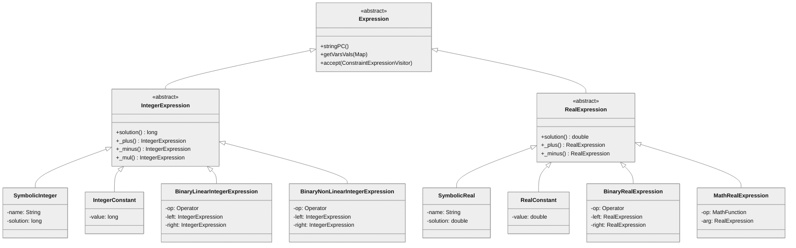
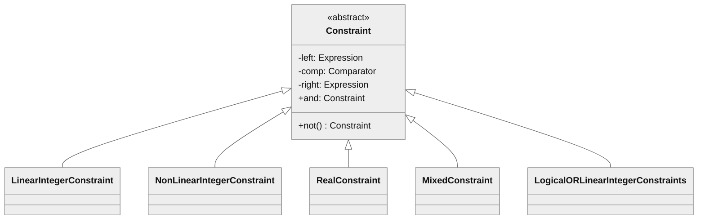
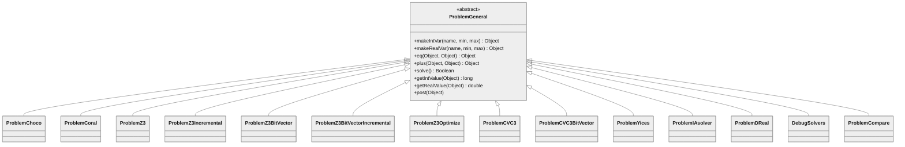

# Module View: Generalization

## Primary Presentation

The Generalization view documents the inheritance hierarchies in JPF-SymBC. Three major hierarchies exist: the expression tree, the constraint tree, and the solver backend abstraction.

## Element Catalog

### Expression Hierarchy

The `Expression` abstract class is the root of all symbolic expression trees. It defines the visitor pattern (`accept`) and serialization (`stringPC`, `prefix_notation`) contracts.

- **`IntegerExpression`** -- Extends `Expression`. Adds operator overloading methods (`_plus`, `_minus`, `_mul`, `_div`, `_neg`, etc.) that construct `BinaryLinearIntegerExpression` or `BinaryNonLinearIntegerExpression` nodes. Provides `solution()` returning `long`.
- **`RealExpression`** -- Extends `Expression`. Parallel structure to `IntegerExpression` for floating-point values. Provides `solution()` returning `double`.
- **Leaf nodes**: `SymbolicInteger`, `SymbolicReal` hold named symbolic variables with a solution slot. `IntegerConstant`, `RealConstant` hold literal values.
- **Internal nodes**: `BinaryLinearIntegerExpression` (linear operations), `BinaryNonLinearIntegerExpression` (multiplication, division, bitwise), `BinaryRealExpression`, `MathRealExpression` (transcendental functions).

Additional specialized subclasses exist in the `string` and `mixednumstrg` packages:
- `SymbolicCharAtInteger`, `SymbolicLengthInteger`, `SymbolicIndexOfInteger` (and variants) -- `IntegerExpression` subclasses for string-derived integer values.
- `SpecialIntegerExpression`, `SpecialRealExpression` -- Mixed numeric-string expression types.

### Constraint Hierarchy

`Constraint` is the abstract base for all constraint nodes. It holds a left `Expression`, a `Comparator`, and a right `Expression`. The `and` field forms a linked list of conjunctions (the path condition chain).

- **`LinearIntegerConstraint`** -- Both sides are `IntegerExpression`. Used for constraints involving only addition, subtraction, and comparison.
- **`NonLinearIntegerConstraint`** -- Both sides are `IntegerExpression`. Used when multiplication, division, or modulo are involved.
- **`RealConstraint`** -- Both sides are `RealExpression`.
- **`MixedConstraint`** -- One side is `IntegerExpression`, the other is `RealExpression`.
- **`LogicalORLinearIntegerConstraints`** -- Disjunction of linear integer constraints.

The `arrays` package adds:
- `ArrayConstraint` -- Constraint involving `ArrayExpression` (select/store operations).
- `RealArrayConstraint` -- Array constraint for real-valued arrays.

### Solver Hierarchy

`ProblemGeneral` is an abstract class that defines the uniform interface for all constraint solver backends. It uses `Object` as the type for solver-specific expression handles, providing a type-erased bridge between the solver-independent constraint model and solver-specific APIs.

All 14 concrete implementations extend `ProblemGeneral` directly (flat hierarchy, no intermediate abstractions).

### Listener Hierarchy (via JPF Core)

JPF-SymBC listeners extend JPF core classes:
- `SymbolicListener`, `HeuristicListener` -- extend `PropertyListenerAdapter` (from jpf-core)
- `GreenListener` -- extends `ListenerAdapter` (from jpf-core)
- `HeapSymbolicListener` -- extends `PropertyListenerAdapter`
- `SymbolicSequenceListener`, `SymbolicAbstractionListener` -- extend `PropertyListenerAdapter`

### Choice Generator Hierarchy (via JPF Core)

- `PCChoiceGenerator` -- extends `IntIntervalGenerator` (from jpf-core). Manages branching for numeric path conditions.
- `HeapChoiceGenerator` -- extends jpf-core choice generator. Manages branching for heap reference resolution.
- `SequenceChoiceGenerator` -- extends jpf-core choice generator for method sequence exploration.

## Context Diagram

All generalization hierarchies described here exist within JPF-SymBC. The parent types (`PropertyListenerAdapter`, `ListenerAdapter`, `IntIntervalGenerator`, `InstructionFactory`) come from jpf-core.

## Variability Guide

- New expression types can be added by subclassing `IntegerExpression`, `RealExpression`, or `Expression` directly. The visitor pattern (via `ConstraintExpressionVisitor`) must be updated to handle new types.
- New constraint types can be added by subclassing `Constraint`. The `PCParser` must be updated to translate the new constraint type into `ProblemGeneral` calls.
- New solver backends require subclassing `ProblemGeneral` and implementing all abstract methods.

## Rationale

The expression hierarchy uses the Composite pattern: leaf nodes (`SymbolicInteger`, `IntegerConstant`) and internal nodes (`BinaryLinearIntegerExpression`) share the `IntegerExpression` interface. This allows constraints and solver translation to work uniformly over any expression tree structure.

The `ProblemGeneral` abstraction uses `Object` for expression handles rather than generics or a type hierarchy. This was a pragmatic choice given the heterogeneous nature of solver APIs (Z3 uses `Expr`, Choco uses `IntegerVariable`, etc.). The trade-off is loss of type safety at the solver boundary.

The flat solver hierarchy (all implementations directly extend `ProblemGeneral`) reflects the independent nature of solver backends. There are no intermediate abstractions for "SMT solvers" vs. "constraint programming solvers" because the `ProblemGeneral` interface already abstracts over these differences.
