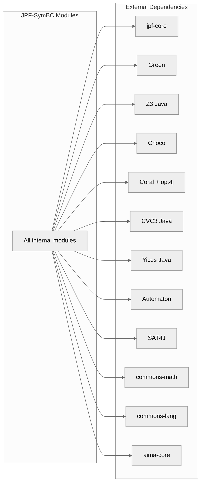

# Module View: Uses

## Primary Presentation

The Uses view shows which modules depend on which others. An arrow from A to B means A requires the correct functioning of B. The diagram below shows inter-module dependencies extracted from import statements across the codebase.

```mermaid
%%{init: {'theme': 'neutral'}}%%
graph TD
    SIF["SymbolicInstructionFactory<br/>(root package)"]
    SL["SymbolicListener(s)<br/>(root package)"]
    BC["bytecode"]
    BC_OPT["bytecode.optimization"]
    BC_SYM["bytecode.symarrays"]
    NUM["numeric"]
    NUM_S["numeric.solvers"]
    NUM_V["numeric.visitors"]
    STR["string"]
    STR_T["string.translate"]
    STR_G["string.graph"]
    HEAP["heap"]
    ARR["arrays"]
    CONC["concolic"]
    SEQ["sequences"]
    ABS["abstraction"]
    MIX["mixednumstrg"]
    TREE_MOD["tree"]
    ANNOT["annotations"]
    CLASSES["classes"]
    PEERS_MOD["peers"]

    JPF_CORE["jpf-core<br/>(external)"]
    GREEN_LIB["Green<br/>(external)"]
    Z3_LIB["Z3 Java API<br/>(external)"]
    CHOCO_LIB["Choco<br/>(external)"]
    CORAL_LIB["Coral<br/>(external)"]
    CVC3_LIB["CVC3 Java API<br/>(external)"]
    AUTO_LIB["Automaton<br/>(external)"]

    SIF --> BC
    SIF --> NUM
    SIF --> NUM_S
    SIF --> GREEN_LIB
    SIF --> JPF_CORE

    SL --> BC
    SL --> NUM
    SL --> CONC
    SL --> JPF_CORE

    BC --> NUM
    BC --> STR
    BC --> HEAP
    BC --> ARR
    BC --> JPF_CORE

    BC_OPT --> NUM
    BC_OPT --> JPF_CORE

    BC_SYM --> NUM
    BC_SYM --> ARR
    BC_SYM --> JPF_CORE

    NUM --> CONC
    NUM --> ARR
    NUM --> STR
    NUM --> NUM_S
    NUM --> NUM_V
    NUM --> JPF_CORE
    NUM --> GREEN_LIB

    NUM_S --> GREEN_LIB
    NUM_S --> Z3_LIB
    NUM_S --> CHOCO_LIB
    NUM_S --> CORAL_LIB
    NUM_S --> CVC3_LIB

    STR --> NUM
    STR --> AUTO_LIB
    STR_T --> STR
    STR_T --> NUM
    STR_T --> AUTO_LIB
    STR_G --> STR

    HEAP --> NUM
    HEAP --> JPF_CORE

    ARR --> NUM

    CONC --> NUM

    SEQ --> NUM
    SEQ --> JPF_CORE

    ABS --> NUM
    ABS --> JPF_CORE

    MIX --> NUM
    MIX --> STR

    TREE_MOD --> NUM
    TREE_MOD --> JPF_CORE

    CLASSES --> JPF_CORE
    PEERS_MOD --> NUM
    PEERS_MOD --> STR
    PEERS_MOD --> JPF_CORE

    ANNOT -.->|"no dependencies"| ANNOT
```

## Element Catalog

### Dependency Summary Table

| Module | Depends On (Internal) | Depends On (External) |
|--------|----------------------|----------------------|
| `SymbolicInstructionFactory` | bytecode, numeric, numeric.solvers | jpf-core, Green |
| `SymbolicListener(s)` | bytecode, numeric, concolic | jpf-core |
| `bytecode` | numeric, string, heap, arrays | jpf-core |
| `bytecode.optimization` | numeric | jpf-core |
| `bytecode.symarrays` | numeric, arrays | jpf-core |
| `numeric` | concolic, arrays, string, numeric.solvers, numeric.visitors | jpf-core, Green |
| `numeric.solvers` | (none internal) | Green, Z3, Choco, Coral, CVC3, Yices |
| `string` | numeric | Automaton |
| `string.translate` | string, numeric | Automaton, Z3-str2, SAT4J |
| `heap` | numeric | jpf-core |
| `arrays` | numeric | (none) |
| `concolic` | numeric | (none) |
| `sequences` | numeric | jpf-core |
| `abstraction` | numeric | jpf-core |
| `mixednumstrg` | numeric, string | (none) |
| `tree` | numeric | jpf-core |
| `annotations` | (none) | (none) |
| `classes` | (none internal) | jpf-core (Verify) |
| `peers` | numeric, string | jpf-core |

### Key Dependency Characteristics

**`numeric` is the central hub**: Every module depends on `numeric` either directly or transitively. It provides the expression tree, constraint, and path condition types that all other modules use.

**`jpf-core` is the external anchor**: Most modules depend on jpf-core for VM abstractions (`Instruction`, `ChoiceGenerator`, `ThreadInfo`, `StackFrame`, `Config`, etc.).

**Solver backends are isolated**: The `numeric.solvers` package has no internal dependencies (other than the numeric expression types it translates from). Each solver implementation depends only on its own external library.

**`annotations` is dependency-free**: The annotations source root has zero dependencies, which is intentional -- it is packaged as a separate JAR for use by non-JPF applications.

## Context Diagram

## Variability Guide

- Adding a new solver backend requires:
  1. A new `ProblemGeneral` subclass in `numeric.solvers`
  2. A new branch in `SymbolicConstraintsGeneral.isSatisfiable()`
  3. The solver's JAR added to `lib/` and registered in `jpf.properties` native_classpath
  4. No changes to `bytecode`, `string`, or `heap` modules

- The Green framework integration provides an alternative dependency path. When Green is active, constraint solving bypasses the direct `ProblemGeneral` implementations and uses `SolverTranslator` to convert to Green expressions. The Green framework then manages solver dispatch, caching, and slicing.

- String constraint solving has its own parallel dependency structure through `SymbolicStringConstraintsGeneral` and the `string.translate` package, independent of the numeric solver dispatch.

## Rationale

The star-shaped dependency structure centered on `numeric` reflects the domain: all symbolic execution operations ultimately produce numeric or relational constraints that must be solved. The bytecode module sits at the top of the dependency chain because it interprets instructions and produces constraints; the solver module sits at the bottom because it consumes constraints and produces solutions.

The isolation of solver backends behind the `ProblemGeneral` interface was a deliberate design choice to allow experimentation with different solvers without modifying the core symbolic execution logic. The cost is the string-based dispatch in `SymbolicConstraintsGeneral`, which uses `equalsIgnoreCase` comparisons rather than a registry pattern.

The parallel `PathCondition`/`StringPathCondition` structure indicates that string constraint handling was added after the numeric system was established, rather than being unified from the start.
